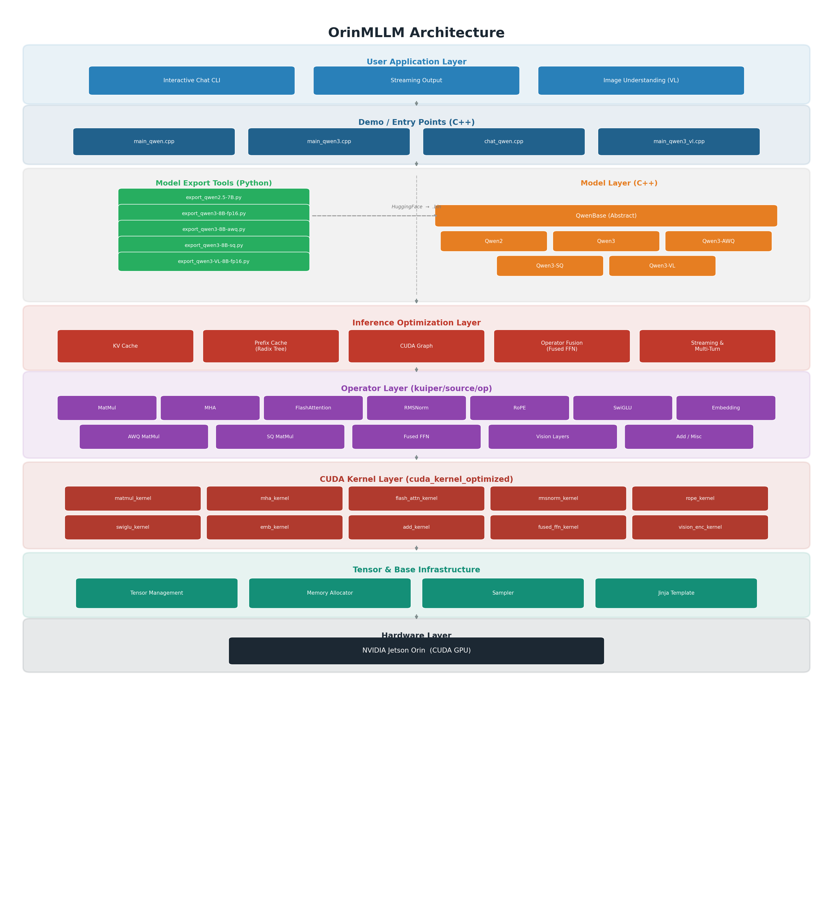

# OrinMLLM

A high-performance Large Language Model (LLM) inference engine designed for **NVIDIA Jetson Orin** edge devices.

---

## Overview

OrinMLLM is an inference framework purpose-built for deploying large language models on **NVIDIA Jetson Orin** platforms. It provides:

- **Model Export Tools** — A collection of Python scripts to convert HuggingFace-format model weights into the framework's optimized binary format.
- **Custom GPU Operators** — Hand-tuned CUDA kernels for MHA (Multi-Head Attention), Flash Attention, RMSNorm, GEMM, RoPE, SwiGLU, Fused FFN, and more, all optimized for the Jetson Orin GPU architecture.
- **Inference Optimizations** — Integration of numerous LLM serving techniques including KV Cache, Prefix Cache (Radix Tree), CUDA Graph capture/replay, operator fusion, streaming output, and multi-turn conversation support.
- **Broad Model Support** — Currently supports the **Qwen2.5 / Qwen3** families of large language models and the **Qwen3-VL** vision-language multimodal model.
- **Multiple Quantization Schemes** — Supports FP32, FP16, AWQ, and SmoothQuant data types for flexible deployment under different memory and latency budgets.

> More model architectures and quantization methods will be supported in future releases.

---

## Architecture

The diagram below illustrates the layered architecture of OrinMLLM, from the user-facing application layer down to the hardware execution layer.



---

## Supported Models

| Model | FP32 | FP16 | AWQ | SmoothQuant |
|:---|:---:|:---:|:---:|:---:|
| Qwen2.5-7B | ✅ | ✅ | — | — |
| Qwen3-8B | — | ✅ | ✅ | ✅ |
| Qwen3-VL-8B | — | ✅ | — | — |

> More models and quantization combinations will be added in future updates.

---

## Get Started

### Environment

#### 1. Export Script Environment

The model export scripts require **PyTorch**, **Transformers**, and related Python packages. These are pre-installed if you have set up your Jetson Orin with **JetPack 5 / JetPack 6.1 or higher**.

If a missing Python package is reported at runtime, simply install it via pip:

```bash
pip install <missing-package>
```

#### 2. Inference Environment

The following third-party libraries must be installed before building the inference engine.

##### 2.1 GCC / G++

Check whether GCC/G++ is already installed on your system:

```bash
gcc -v
g++ -v
```

The author used **GCC/G++ 11.4**, which is the default compiler shipped with Ubuntu 22.04. If the commands above fail, install the compilers with:

```bash
sudo apt update
sudo apt install gcc
sudo apt install g++
```

##### 2.2 CUDA

CUDA is bundled with JetPack — **no manual installation is required**.

##### 2.3 Armadillo (Math Library)

OrinMLLM depends on the Armadillo linear algebra library. Install its underlying dependencies (OpenBLAS, LAPACK, etc.) first, then build Armadillo from the bundled source:
Download from the official website: Visit the Armadillo download page, download the latest version (e.g., armadillo-12.6.4.tar.xz), and extract it to your local machine.

```bash
sudo apt install libopenblas-dev liblapack-dev libarpack2-dev libsuperlu-dev

cd armadillo-15.2.2
mkdir -p build && cd build
cmake -DCMAKE_BUILD_TYPE=Release ..
make -j8
sudo make install
```

##### 2.4 Google Test (Unit Testing)

Used for verifying the correctness of framework components:

```bash
git clone https://github.com/google/googletest.git ~/googletest
cd googletest
mkdir -p build && cd build
cmake -DCMAKE_BUILD_TYPE=Release ..
make -j8
sudo make install
```

##### 2.5 Google Logging (glog)

Used for runtime logging. Disable unnecessary build options during installation:

```bash
git clone https://github.com/google/glog.git ~/glog
cd glog
mkdir -p build && cd build
cmake -DCMAKE_BUILD_TYPE=Release -DWITH_GFLAGS=OFF -DWITH_GTEST=OFF ..
make -j8
sudo make install
```

##### 2.6 SentencePiece (Tokenizer)

Used for tokenizing input text for the language models:

```bash
git clone https://github.com/google/sentencepiece.git ~/sentencepiece
cd sentencepiece
mkdir -p build && cd build
cmake -DCMAKE_BUILD_TYPE=Release ..
make -j8
sudo make install
```

##### 2.7 RE2 (Regular Expression Library)

```bash
git clone git@github.com:google/re2.git ~/re2
cd re2
mkdir -p build && cd build
cmake -DCMAKE_BUILD_TYPE=Release ..
make -j8
sudo make install
```

##### 2.8 Build the Project

```bash
cd OrinMLLM
mkdir -p build && cd build
cmake -DQWEN2_SUPPORT=ON -DQWEN3_SUPPORT=ON -DQWEN3_VL_SUPPORT=ON ..
make -j8
```

---

## Inference Demo

### Download Models

Before running inference, download the desired model from [ModelScope](https://modelscope.cn). For example, to download **Qwen3-8B**:

```bash
mkdir -p Qwen3-8B
modelscope download --model Qwen/Qwen3-8B --local_dir ./Qwen3-8B
```

Repeat with the appropriate model name for other models (e.g., `Qwen/Qwen2.5-7B`, `Qwen/Qwen3-VL-8B-Instruct`, etc.).

---

### 1. Qwen3-8B FP16

**Export & Run:**

```bash
cd OrinMLLM
python tools/export_qwen3-8B-fp16.py Qwen3-8B-fp16.bin --dtype fp16 --hf Qwen3-8B

./build/demo/qwen3_infer \
    Qwen3-8B-fp16.bin \
    Qwen3-8B/tokenizer.json \
    --stream --max-tokens 1024 --prefix-cache --interactive
```

**Demo:**

https://github.com/yhwang-hub/assets/Qwen3-8B-fp16.mp4

<video src="screens/Qwen3-8B-fp16.mp4" controls width="800"></video>

---

### 2. Qwen3-8B AWQ

> **Note:** `Qwen3-8B-awq` refers to a HuggingFace-format model that has been pre-quantized with AWQ.

**Export & Run:**

```bash
cd OrinMLLM
python tools/export_qwen3-8B-awq.py Qwen3-8B-awq.bin --hf Qwen3-8B-awq

./build/demo/qwen3_infer \
    Qwen3-8B-awq.bin \
    Qwen3-8B/tokenizer.json \
    --stream --max-tokens 1024 --prefix-cache --interactive
```

**Demo:**

<video src="screens/Qwen3-8B-awq.mp4" controls width="800"></video>

---

### 3. Qwen3-8B SmoothQuant

> **Note:** `Qwen3-8B-sq` refers to a HuggingFace-format model that has been pre-quantized with SmoothQuant.

**Export & Run:**

```bash
cd OrinMLLM
python tools/export_qwen3-8B-sq.py Qwen3-8B-sq.bin --hf Qwen3-8B-sq

./build/demo/qwen3_infer \
    Qwen3-8B-sq.bin \
    Qwen3-8B-sq/tokenizer.json \
    --stream --max-tokens 1024 --prefix-cache --interactive
```

**Demo:**

<video src="screens/Qwen3-8B-sq.mp4" controls width="800"></video>

---

### 4. Qwen3-VL-8B FP16 (Vision-Language)

**Export & Run:**

```bash
cd OrinMLLM
python tools/export_qwen3-VL-8B-fp16.py Qwen3-VL-8B-fp16.bin --hf Qwen3-VL-8B-Instruct

./build/demo/qwen3_vl_infer \
    Qwen3-VL-8B-fp16.bin \
    Qwen3-VL-8B-Instruct/tokenizer.json \
    --image hf_infer/demo.jpeg \
    --prompt "Describe this image." \
    --cuda-graph --stream --max-pixel 500000
```

**Demo:**

<video src="screens/Qwen3-VL-8B-fp16.mp4" controls width="800"></video>

---

## License

This project is for research and educational purposes. Please comply with the license terms of all third-party dependencies and model weights used.
