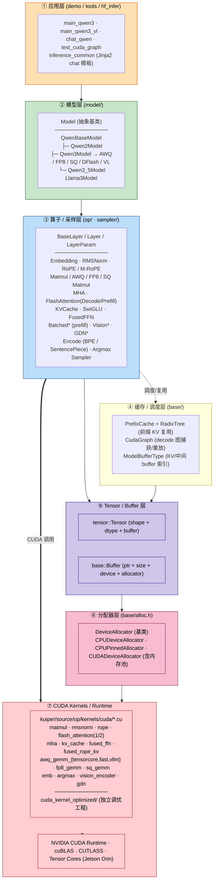
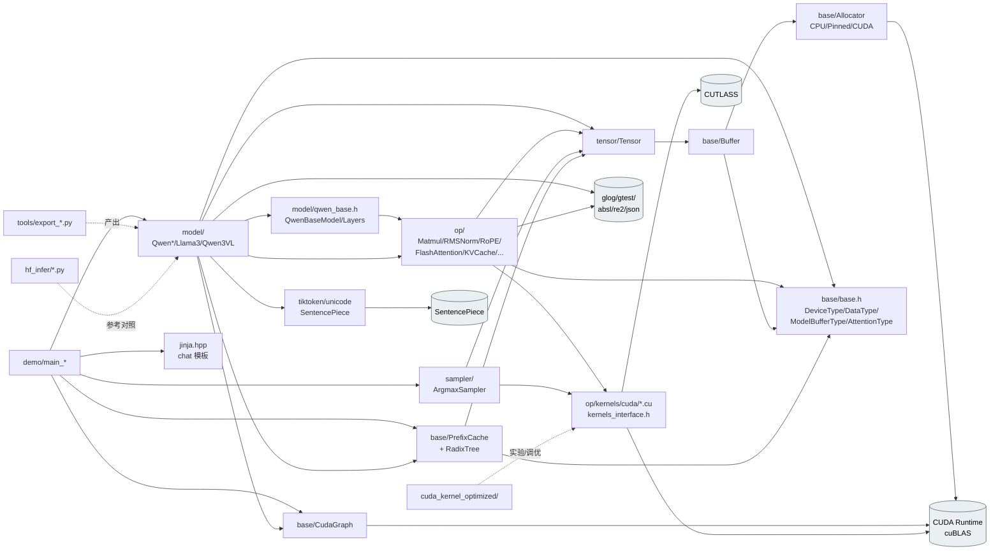

# OrinMLLM 工程架构分析报告

> 本报告对 `OrinMLLM` 工程进行系统化分析，依次回答：(1) 各模块功能与调用方式；(2) 从应用层到 CUDA 操作的分层架构图；(3) 模块之间的依赖/调用关系图。
> 报告路径：[docs/OrinMLLM_Project_Architecture_Report.md](OrinMLLM_Project_Architecture_Report.md)

---

## 0. 工程总览

`OrinMLLM` 是一个面向 NVIDIA Jetson Orin 平台、用 C++/CUDA 实现的多模态/大语言模型推理引擎。其核心目录如下：

```
OrinMLLM/
├── kuiper/                     # 推理引擎核心库（C++/CUDA）
│   ├── include/                # 对外头文件（base / tensor / op / model / sampler）
│   └── source/                 # 实现文件（含 op/kernels/cuda/* CUDA 算子）
├── demo/                       # 应用层 demo（chat、推理、CUDA Graph 测试）
├── tools/                      # 模型权重导出脚本（HuggingFace → 自有二进制格式）
├── hf_infer/                   # HuggingFace Python 推理对照参考
├── cuda_kernel_optimized/      # 独立的 CUDA Kernel 调优工程（含 Nsight 报告）
├── 3rdparty/                   # CUTLASS 等第三方库
├── test/                       # 单元测试
└── cmake/ + CMakeLists.txt     # 构建系统
```

---

## 1. 模块功能与调用方式

`kuiper/` 库由 5 个主模块组成：**base、tensor、op (含 kernels)、model、sampler**。应用层在 `demo/`，工具脚本在 `tools/`、`hf_infer/`。

### 1.1 base 模块 — 基础设施

位置：[kuiper/include/base/](../kuiper/include/base/) ；[kuiper/source/base/](../kuiper/source/base/)

| 文件 | 功能 |
|------|------|
| `base.h` | 枚举：`DeviceType` (CPU/CUDA)、`DataType` (FP32/FP16/INT8/INT32/FP8)、`ModelBufferType` (KV cache/中间 buffer 等)、`AttentionType` (MHA / FlashAttention 1/2)。 |
| `alloc.h` | 内存分配器抽象：`DeviceAllocator` 基类、`CPUDeviceAllocator`、`CPUPinnedAllocator`、`CUDADeviceAllocator`（带内存池）。提供工厂单例。 |
| `buffer.h` | `Buffer` 类：包装裸内存指针 + 设备类型 + 分配器；支持外部指针、跨设备 `copy_from()`。 |
| `cuda_config.h` | CUDA 流、句柄、配置工具。 |
| `cuda_graph.h` | `CudaGraph`：捕获/重放 decode 阶段算子图，降低 kernel 启动开销。 |
| `prefix_cache.h` + `radix_tree.h` | `PrefixCache` + `RadixTree`：SGLang 风格的多请求 KV cache 前缀共享与 LRU 淘汰。 |
| `tiktoken.h` / `unicode*.h` | Tokenizer 辅助（tiktoken 编解码、Unicode 处理）。 |
| `tick.h` | 计时工具。 |

**调用方式**（典型）：
```cpp
auto alloc  = base::CUDADeviceAllocatorFactory::get_instance();
auto buffer = std::make_shared<base::Buffer>(byte_size, alloc);
buffer->allocate();
```

---

### 1.2 tensor 模块 — 张量

位置：[kuiper/include/tensor/tensor.h](../kuiper/include/tensor/tensor.h)

- `tensor::Tensor`：多维数组，持有 `shared_ptr<Buffer>`，维护 `dims_/strides_/data_type_`。
- 关键 API：`ptr<T>()`、`index<T>(off)`、`reshape()`、`dims()/size()/byte_size()`、`allocate(alloc)`、`to_cpu()/to_cuda()`、`assign(buffer)`。

**调用方式**：
```cpp
tensor::Tensor logits(base::DataType::kDataTypeFp16, vocab_size, true, alloc);
auto* p = logits.ptr<__half>();
```

---

### 1.3 op / layer 模块 — 算子层

位置：[kuiper/include/op/](../kuiper/include/op/) ；实现：[kuiper/source/op/](../kuiper/source/op/) ；CUDA kernel：[kuiper/source/op/kernels/cuda/](../kuiper/source/op/kernels/cuda/)

**基类**：`BaseLayer` → `Layer`（带输入/输出 Tensor 管理）→ `LayerParam`（带权重）。统一接口 `check()` / `forward()` / `set_input()` / `set_output()`。

**算子分类**：

| 类别 | 头文件 | 主要类 |
|------|--------|--------|
| 基础 | `add.h`、`rmsnorm.h`、`swiglu.h`、`embedding.h` | `VecAddLayer`、`RmsNormLayer`、`SwiGLULayer`、`EmbeddingLayer` |
| Attention | `mha.h`、`flash_attention.h`、`kv_cache.h`、`rope.h` | `MultiHeadAttention`、`FlashAttentionDecodeLayer/PrefillLayer`、`KVCacheLayer`、`RoPELayer` |
| 量化 GEMM | `matmul.h`、`awq_matmul.h`、`fp8_matmul.h`、`sq_matmul.h` | `MatmulLayer`、`AWQMatmulLayer`（INT4）、`FP8MatmulLayer`、`SQMatmulLayer`（SmoothQuant INT8） |
| Prefill 批量 | `batched_add.h`、`batched_matmul.h`、`batched_rope.h` | `BatchedAddLayer`、`BatchedMatmulLayer`、`BatchedRoPELayer`、`BatchedMRoPELayer` |
| 融合 | `fused_ffn.h`、`misc_layers.h` | `FusedFFNLayer`、`FusedMRoPEKVWriteLayer`、`FusedGQAMRoPEKVDecodeLayer` |
| 视觉 | `vision_layers.h` | `ExtractPatchesLayer`、`VisionAttentionLayer`、`VisionMLPLayer`、`SpatialMergeLayer` 等 10 个 |
| GDN | `gdn_layers.h` | GDN 模型的 13 个专用层 |
| Encode | `encode.h` | `SpeEncodeLayer`（SentencePiece）、`BpeEncodeLayer`（Qwen3）、`QwenEncodeLayer` |

**调用方式**：
```cpp
op::MatmulLayer wq(base::DeviceType::kDeviceCUDA, out_dim, in_dim);
wq.set_weight(0, weight_tensor);
wq.set_input(0, x);  wq.set_output(0, y);
wq.forward();
```

底层 CUDA kernel（部分）：`matmul_kernel.cu`、`rmsnorm_kernel.cu`、`rope_kernel.cu`、`flash_attention_kernel.cu`、`flash_attention2_kernel.cu`、`fused_ffn_kernel.cu`、`fused_rope_kv_kernel.cu`、`mha_kernel.cu`、`awq_gemm_{tensorcore,fast,vllm}.cu`、`fp8_gemm_kernel.cu`、`sq_gemm_kernel.cu`、`emb_kernel.cu`、`kv_cache_kernel.cu`、`argmax_kernel.cu`、`vision_encoder_kernel.cu` 等，全部通过 `kernels_interface.h` 进行统一派发。

---

### 1.4 model 模块 — 模型层

位置：[kuiper/include/model/](../kuiper/include/model/)

| 文件 | 说明 |
|------|------|
| `config.h` | `ModelConfig`、`TransformerConfig`（dim、hidden_dim、layer_num、head_num、vocab_size、seq_len）。 |
| `raw_model_data.h` | 二进制权重文件读取。 |
| `model.h` | 抽象基类 `Model`：定义 `init()` / `predict()` / `forward()` / `embedding()` / `encode()` / `decode()` / `get_buffer()`。 |
| `qwen_base.h` | `QwenBaseModel` + `QwenBaseLayers`：共享 Qwen2/3 系列的算子实例与逐层权重 (wq/wk/wv/wo, w1/w2/w3, rmsnorm 等)。 |
| `qwen2.h` | `Qwen2Model`（Qwen2.5-7B FP32/FP16）。 |
| `qwen3.h` | `Qwen3Model` + `Qwen3Layers`（FP16，引入 M-RoPE、融合 kernel、CUDA Graph）。 |
| `qwen3_awq.h` / `qwen3_fp8.h` / `qwen3_sq.h` | Qwen3-8B 的 INT4 (AWQ) / FP8 E4M3 / INT8 (SmoothQuant) 量化模型。 |
| `qwen3_dflash.h` | Qwen3 + DFlash 推测解码。 |
| `qwen3_vl.h` | `Qwen3VLModel` + `Qwen3VLLayers`：视觉编码器 + 语言模型。 |
| `qwen3_5.h` | Qwen3.5-9B。 |
| `llama3.h` | Llama3 (条件编译 `LLAMA3_SUPPORT`)。 |

**模型继承层级**：
```
Model
 ├─ QwenBaseModel
 │   ├─ Qwen2Model
 │   ├─ Qwen3Model ── Qwen3AWQModel / Qwen3FP8Model / Qwen3SQModel / Qwen3DFlashModel / Qwen3VLModel
 │   └─ Qwen3_5Model
 └─ Llama3Model
```

**调用方式**：
```cpp
auto model = std::make_unique<model::Qwen3Model>(tokenizer_path, model_path);
model->init(base::DeviceType::kDeviceCUDA);
auto emb_out = model->embedding({"你好"});
int next = model->predict(emb_out.embeddings, pos_tensor, /*is_prompt=*/true);
```

---

### 1.5 sampler 模块 — 采样

位置：[kuiper/include/sampler/](../kuiper/include/sampler/)

- `Sampler`：抽象基类，`sample(logits, size) → token_id`。
- `ArgmaxSampler`：贪心采样，底层调 `argmax_kernel.cu`。

---

### 1.6 应用层 — demo / tools / hf_infer

**demo/（C++ 可执行程序）**：

| 文件 | 用途 |
|------|------|
| `main_qwen3.cpp` | 主入口：Qwen3 多轮 chat，自动识别 FP16/AWQ/FP8/SQ，支持流式、CUDA Graph、RadixTree 前缀缓存。 |
| `main_qwen3_5.cpp` | Qwen3.5-9B demo。 |
| `main_qwen3_vl.cpp` | Qwen3-VL 多模态 (图 + 文) demo。 |
| `main_qwen2.cpp` / `main_qwen.cpp` / `chat_qwen.cpp` / `main.cpp` | 早期 Qwen / Llama 推理与对话入口。 |
| `inference_common.h` | 公共推理流程：`run_model_inference<ModelClass>()`、Jinja2 chat 模板、消息构造。 |
| `test_cuda_graph.cpp` | CUDA Graph 基准测试。 |

调用模式：`Model::init()` → `encode()` → 循环 `predict()` + `Sampler::sample()` → `decode()`。

**tools/（Python，权重导出）**：`export_qwen3-8B-{fp16,awq,fp8,sq}.py`、`export_qwen3-VL-8B-fp16.py`、`export_qwen3-5-9B-fp16.py`、`export_qwen2.5-7B.py`、`export_llama3.py`、`export_eagle3.py` 等。

**hf_infer/（Python，HF 对照推理）**：`qwen3_infer.py`、`qwen3_vl_infer.py`、`llama3_infer.py` 等。

---

## 2. 工程分层架构图

> 仅展示从「应用层 → 模型层 → 算子/缓存层 → Tensor/Buffer 层 → 分配器/CUDA」的层次结构，不展开实现细节。



**说明**：
- 应用层只依赖 `Model` 抽象 + `inference_common.h` 的封装；
- 模型层组合算子层 + 缓存层完成 prefill / decode；
- 算子层通过 `kernels_interface.h` 派发到 CUDA kernel；
- Tensor/Buffer 是数据载体，统一从 `DeviceAllocator` 获取显存/内存；
- CUDA Graph、PrefixCache 属于横切的优化设施，被模型层显式使用。

---

## 3. 模块间依赖 / 调用关系图

> 展示模块之间的 `#include` 与运行时调用关系，箭头方向为「调用者 → 被调用者」。



### 关键调用链（运行时）

| 调用方 | 被调方 | 典型 API |
|--------|--------|----------|
| `demo/main_qwen3` | `model::Qwen3Model` | `init()` / `encode()` / `predict()` / `decode()` |
| `Model::predict()` | `op::*Layer::forward()` | 逐层前向 |
| `Layer::forward()` | `tensor::Tensor` | `ptr<T>()` / `dims()` / `reshape()` |
| `Layer::forward()` | `kernels/cuda/*` | `kernels_interface.h` 派发 CUDA kernel |
| `Tensor::allocate()` | `base::Buffer` | `copy_from()` / `ptr()` |
| `Buffer::allocate()` | `DeviceAllocator` | `allocate()` / `release()` / `memcpy()` |
| `Model::forward()` (decode) | `base::CudaGraph` | `capture()` / `replay()` |
| `Model::predict()` (多请求) | `base::PrefixCache` | `match()` / `insert()` / `evict()` |
| `Model::encode()` | `op::*EncodeLayer` + `tiktoken`/SentencePiece | 分词 |
| `Model` 输出 | `sampler::ArgmaxSampler::sample()` | 贪心选 token |

### `#include` 依赖示例

```
demo/main_qwen3.cpp
  └─ model/qwen3.h
       ├─ model/qwen_base.h
       │    ├─ op/flash_attention.h
       │    ├─ op/kv_cache.h
       │    ├─ op/rope.h, swiglu.h, rmsnorm.h, add.h, matmul.h …
       │    │    ├─ tensor/tensor.h
       │    │    │    ├─ base/buffer.h ─► base/alloc.h ─► <cuda_runtime.h>
       │    │    │    └─ base/base.h
       │    │    └─ op/kernels/cuda/kernels_interface.h ─► *.cu
       │    └─ base/cuda_graph.h, base/prefix_cache.h, base/radix_tree.h
       └─ jinja.hpp / sampler/argmax_sampler.h
```

---

## 4. 第三方依赖速览

| 依赖 | 来源 | 用途 |
|------|------|------|
| CUDA Runtime / cuBLAS | JetPack 自带 | GPU 计算、内存管理 |
| CUTLASS | `3rdparty/` | 高性能模板 GEMM |
| SentencePiece (v0.2.0) | CPM | Qwen2 / Llama tokenizer |
| abseil-cpp + re2 | CPM | Qwen3 BPE 所需的字符串/正则 |
| nlohmann_json | CPM | 配置/对话 JSON |
| glog | CPM | 日志 / CHECK 宏 |
| gtest | CPM | 单元测试 |
| jinja.hpp | bundled in `kuiper/include/` | chat 模板渲染 |
| stb | bundled | 图像加载（VL 模型） |
| Armadillo | 系统安装 | CPU 端线性代数辅助 |

---

## 5. 总结

- **分层清晰**：自顶向下依次是 *Demo → Model → Op/Layer → Tensor → Buffer → Allocator → CUDA Kernel*，每层只对相邻下层有强依赖。
- **基类抽象 + 多变体**：`Model` / `Layer` / `Sampler` / `DeviceAllocator` 均采用「抽象基类 + 派生实现」模式，便于扩展量化变体（AWQ / FP8 / SQ）与多模态（Qwen3-VL）。
- **优化设施横切**：`CudaGraph`（降低 decode 启动开销）和 `PrefixCache + RadixTree`（多请求 KV 复用）作为独立模块在 `base/` 中提供，被 `Model` 显式集成。
- **算子→Kernel 统一派发**：所有 `Layer::forward()` 通过 `kernels_interface.h` 调用 `kuiper/source/op/kernels/cuda/*.cu`，而 `cuda_kernel_optimized/` 是独立的 kernel 调优实验场。
- **工具链闭环**：`tools/export_*.py` 把 HuggingFace 权重导出为自有二进制；`hf_infer/` 提供 Python 对照参考；`demo/` 提供 C++ 端到端推理入口。
