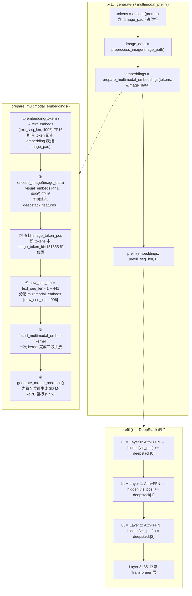
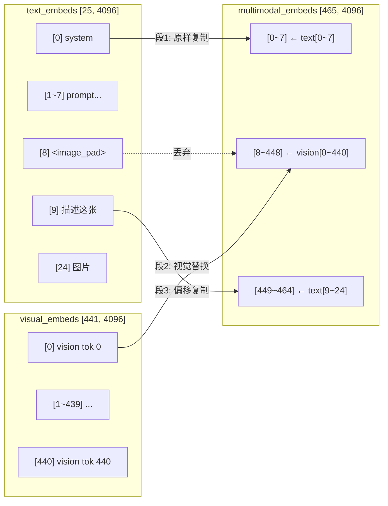
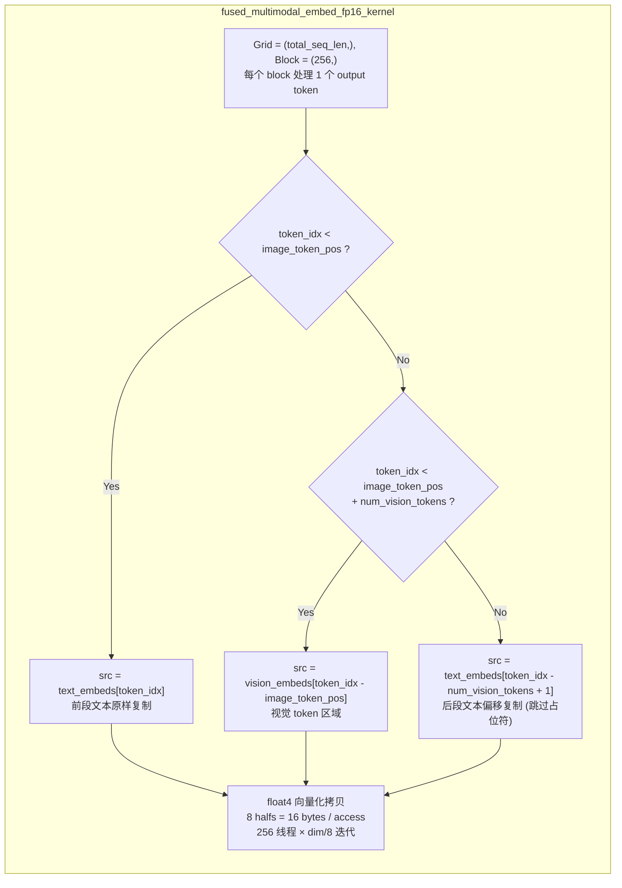
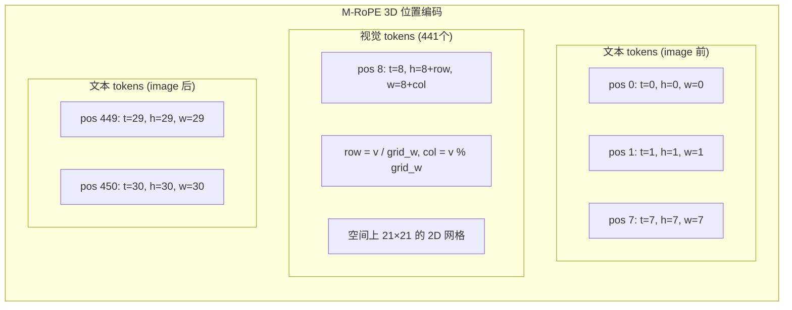
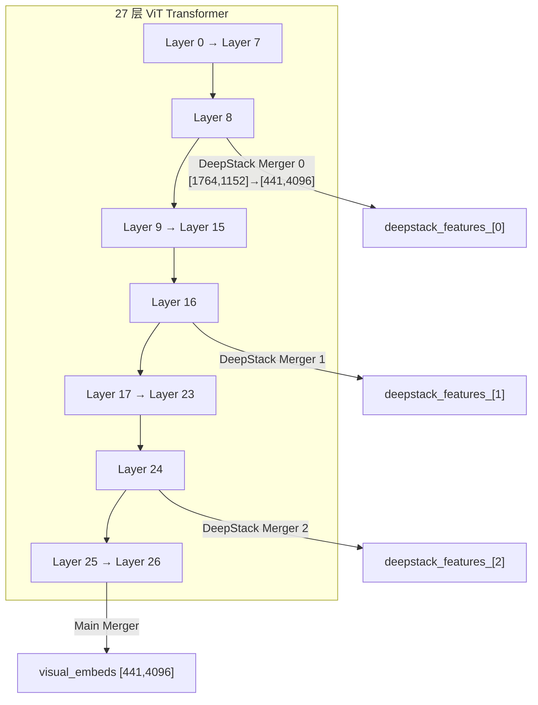

# Qwen3-VL ViT 输出与 Prefill Embedding 融合机制分析报告

> 分析对象：`kuiper/source/model/qwen3_vl.cpp` 中视觉特征与语言模型输入的融合流程  
> 分析日期：2026-03-17

---

## 一、全局流程概览



ViT 输出融入 LLM prefill 的过程可以分为**两个阶段**：

1. **Embedding 拼接**（`prepare_multimodal_embeddings`）：将 ViT 主输出替换 `<image_pad>` 占位符，与文本 embedding 拼接成统一序列
2. **DeepStack 注入**（`prefill` 前 N 层）：将 ViT 中间层的多尺度特征叠加到 LLM 隐藏状态的视觉 token 位置

---

## 二、阶段 1：Embedding 拼接

### 2.1 输入准备

融合入口函数 `prepare_multimodal_embeddings()` 位于 qwen3_vl.cpp:1843。它接收原始 token 序列和图像数据，输出融合后的 multimodal embedding tensor。

#### 步骤 ① — 文本 Embedding

```cpp
auto embed_out = embedding(tokens);
// → text_embeds [text_seq_len, 4096] FP16
```

调用 `embedding()` (qwen3_vl.cpp:2544)，将**所有 token**（包括 `<image_pad>` 占位符 token_id=151655）通过 embedding 查表映射为 4096 维 FP16 向量。占位符的 embedding 值后续会被丢弃。

#### 步骤 ② — ViT 编码

```cpp
auto visual_embeds = encode_image(*image_data);
// → visual_embeds [441, 4096] FP16
// 副作用: deepstack_features_ 被填充
```

调用 `encode_image()` (qwen3_vl.cpp:1365)，完整流程：
1. Patch Embedding: `[1764, 1536] → [1764, 1152]`
2. Position Embedding: 双线性插值
3. 27 层 ViT Transformer（双缓冲策略）
4. 主 Merger: `[1764, 1152] → [441, 4096]`
5. 3 个 DeepStack Merger 从第 8/16/24 层提取中间特征

#### 步骤 ③ — 定位图像占位符

```cpp
int image_token_pos = -1;
for (int i = 0; i < tokens.size(); ++i) {
    if (tokens[i] == image_token_id) {  // 151655
        image_token_pos = i;
        break;
    }
}
```

在 token 序列中找到第一个 `<image_pad>` 的位置索引 `image_token_pos`。这个位置将被 441 个视觉 token 替换。

#### 步骤 ④ — 计算新序列长度

```cpp
int new_seq_len = tokens.size() - 1 + num_vision_tokens;
// 例如: 25 - 1 + 441 = 465
```

减去 1 个被替换的占位符，加上 441 个视觉 token。

### 2.2 三段拼接（核心）

#### 拼接原理



output 被分为三个连续区域：

| 区域 | output 范围 | 来源 | 说明 |
|------|------------|------|------|
| 段1: 前段文本 | `[0, image_token_pos)` | `text_embeds[0..image_token_pos-1]` | 原样复制 |
| 段2: 视觉 token | `[image_token_pos, image_token_pos+441)` | `visual_embeds[0..440]` | 替换占位符 |
| 段3: 后段文本 | `[image_token_pos+441, new_seq_len)` | `text_embeds[image_token_pos+1..end]` | 跳过占位符偏移复制 |

#### Fused Kernel 实现

拼接由 `fused_multimodal_embed_fp16_kernel` 在一次 kernel launch 中完成（qwen3_vl.cpp:1918），替代了原来 3 次 `cudaMemcpyAsync`：



**关键实现细节**（fused_kernels.cu:46-97）：

- **Grid 划分**：`total_seq_len` 个 block，每个 block 独立处理一行（一个 token 的 4096 维向量）
- **三路分支**：根据 `token_idx` 所在区域决定数据源指针和偏移
- **后段文本偏移公式**：`src_offset = (token_idx - num_vision_tokens + 1) * dim`，`+1` 是因为跳过了被替换的占位符
- **float4 向量化**：每次读写 128 位（8 个 half），`dim/8 = 512` 次迭代，256 线程每线程仅 2 次循环迭代

---

## 三、阶段 2：M-RoPE 位置编码

拼接完成后，`generate_mrope_positions()` (qwen3_vl.cpp:1947) 为新序列中的每个位置生成 3 维 M-RoPE 坐标 `(t, h, w)`：



| 位置类型 | t 维度 | h 维度 | w 维度 |
|---------|--------|--------|--------|
| 前段文本 | 递增 `pos` | 递增 `pos` | 递增 `pos` |
| 视觉 token | 固定 `base` | `base + row` | `base + col` |
| 后段文本 | 从 `base + max(grid_h, grid_w)` 递增 | 同 t | 同 t |

- **文本 token**：三个维度相同，等价于标准 1D 位置编码
- **视觉 token**：`t` 固定（单帧图像），`h/w` 反映 2D 空间网格位置，使模型能感知图像的空间结构
- **后段文本**：从视觉区域的最大位置之后继续递增，保持因果顺序的连续性

---

## 四、阶段 3：DeepStack 注入

### 4.1 特征提取

在 `encode_image()` 的 ViT Transformer 循环中，当层索引匹配 `deepstack_visual_indexes`（默认 [8, 16, 24]）时，当前层的输出会通过一个独立的 DeepStack Merger 降维，产生中间层视觉特征：



每个 DeepStack Merger 与主 Merger 结构相同（`vision_merger()`, qwen3_vl.cpp:1782）：
1. **LayerNorm**: 对该层输出 `[1764, 1152]` 标准化
2. **spatial_merge**: 将空间相邻 2×2 patch 拼接 → `[441, 4608]`
3. **MLP**: `fc1(4608→4608) → GELU → fc2(4608→4096)` → `[441, 4096]`

但使用各自独立的权重（`deepstack_mergers[i]`）。

### 4.2 注入过程

在 `prefill()` (qwen3_vl.cpp:2066) 的逐层循环中，**前 N 层**（N = deepstack 特征数 = 3）在完成 Attention + FFN 后，将 DeepStack 特征**逐元素加**到隐藏状态的视觉 token 位置：

```cpp
// prefill() 核心片段 (qwen3_vl.cpp:2166-2180)
if (layer_idx < num_deepstack_layers && visual_pos_start_ >= 0) {
    int num_visual_tokens = visual_pos_end_ - visual_pos_start_;
    const auto& ds_feat = deepstack_features_[layer_idx];
    
    // 只修改视觉 token 位置的隐藏状态
    half* hidden_ptr = layer_output->ptr<half>() + visual_pos_start_ * dim;
    const half* ds_ptr = ds_feat.ptr<half>();
    
    // element-wise add: hidden[vis_start:vis_end] += deepstack[layer_idx]
    STATUS_CHECK(qwen_layers_->batched_add_layer_->forward_raw(
        hidden_ptr, ds_ptr, hidden_ptr, num_visual_tokens * dim));
}
```

**关键设计**：
- DeepStack 特征和主视觉 embedding 维度完全相同 `[441, 4096]`，可以直接相加
- **只修改视觉 token 对应的位置**（`visual_pos_start_` 到 `visual_pos_end_`），文本 token 不受影响
- 使用 `batched_add_layer_->forward_raw()` 的原始指针接口，避免创建临时 Tensor slice
- Layer 0 注入浅层特征（ViT 第 8 层），Layer 1 注入中层特征（第 16 层），Layer 2 注入深层特征（第 24 层），构成多尺度视觉信息输入

---

## 五、完整数据流总结

以典型输入为例：25 个文本 token（含 1 个 `<image_pad>`）+ 672×672 图像

```
                        ┌─────────────────────────┐
                        │    Token 序列 (25个)      │
                        │ [system, ..., , ...] │
                        └────────┬────────────────┘
                                 │
                ┌────────────────┼────────────────┐
                ▼                                  ▼
    ┌───────────────────┐              ┌──────────────────────┐
    │  embedding(tokens) │              │   preprocess_image()  │
    │  查表 → FP16       │              │  resize+norm+patches  │
    │  [25, 4096]        │              │  [1764, 1536] FP16    │
    └────────┬──────────┘              └──────────┬───────────┘
             │                                     │
             │                          ┌──────────▼───────────┐
             │                          │   encode_image()      │
             │                          │  patch_embed → ViT×27 │
             │                          │  ──────────────────── │
             │                          │  Layer  8 → DS[0]     │
             │                          │  Layer 16 → DS[1]     │
             │                          │  Layer 24 → DS[2]     │
             │                          │  Layer 26 → Main      │
             │                          │  ──────────────────── │
             │                          │  main: [441, 4096]    │
             │                          │  DS: 3×[441, 4096]    │
             │                          └──────────┬───────────┘
             │                                     │
             └───────────┬─────────────────────────┘
                         ▼
          ┌──────────────────────────────┐
          │  fused_multimodal_embed_cu() │
          │  text[0:8] | vision[0:441]  │
          │           | text[9:25]      │
          │  → multimodal_embeds        │
          │    [465, 4096] FP16         │
          └──────────────┬──────────────┘
                         │
                         ▼
          ┌──────────────────────────────┐
          │  generate_mrope_positions()  │
          │  文本: (pos,pos,pos)          │
          │  视觉: (base, base+row,      │
          │         base+col)            │
          └──────────────┬──────────────┘
                         │
                         ▼
          ┌──────────────────────────────┐
          │        prefill()             │
          │  ▸ Layer 0: Attn+FFN         │
          │    hidden[8:449] += DS[0]    │
          │  ▸ Layer 1: Attn+FFN         │
          │    hidden[8:449] += DS[1]    │
          │  ▸ Layer 2: Attn+FFN         │
          │    hidden[8:449] += DS[2]    │
          │  ▸ Layer 3~35: 正常处理      │
          │  ▸ cls_logits → sample       │
          └──────────────────────────────┘
```

---

## 六、设计要点与优化分析

### 6.1 融合 vs 替换策略

OrinMLLM 采用的是 **"替换占位符"** 的融合策略，而非 cross-attention：
- 优点：LLM 架构完全不变，视觉和文本 token 共享同一套 Self-Attention
- 代价：视觉 token 占用 KV Cache 空间（441 × 36 层 × 2(K+V) × 1024 维 ≈ 62 MB FP16）

### 6.2 三次 cudaMemcpyAsync → 一次 Kernel：详细分析

#### 6.2.1 原始实现：3 次 cudaMemcpyAsync

在未融合的方案中，三段拼接需要 3 次独立的 `cudaMemcpyAsync` Device-to-Device 调用：

```cpp
// === 原始方案 (已被替换) ===
// 段1: 复制前段文本
cudaMemcpyAsync(output,
                text_embeds,
                image_token_pos * dim * sizeof(half),
                cudaMemcpyDeviceToDevice, stream);

// 段2: 复制视觉 token
cudaMemcpyAsync(output + image_token_pos * dim,
                vision_embeds,
                num_vision_tokens * dim * sizeof(half),
                cudaMemcpyDeviceToDevice, stream);

// 段3: 复制后段文本 (跳过占位符)
cudaMemcpyAsync(output + (image_token_pos + num_vision_tokens) * dim,
                text_embeds + (image_token_pos + 1) * dim,
                (text_seq_len - image_token_pos - 1) * dim * sizeof(half),
                cudaMemcpyDeviceToDevice, stream);
```

每次 `cudaMemcpyAsync` 调用产生以下开销：

| 开销项 | 说明 |
|--------|------|
| **CPU 端 driver API 调用** | 每次 ~3-8μs：用户态→内核态→CUDA driver→命令入队 |
| **GPU command processor 解析** | GPU 前端需解析命令并分发给 copy engine 或 SM |
| **DMA 引擎启动** | D2D copy 通过 GPU 内部的 copy engine 执行，每次启动有固定延迟 |
| **流同步开销** | 3 个操作在 stream 内串行排队，增加 command buffer 调度粒度 |

3 次调用的**累计 CPU 端开销约 15-25μs**。对于 prefill 阶段这是小量，但该函数在每次图像推理时都被调用，且后续还有 M-RoPE 计算等时间敏感操作。

#### 6.2.2 融合后：1 次 Kernel Launch

```cpp
// === 融合方案 ===
fused_multimodal_embed_fp16_kernel<<<total_seq_len, 256, 0, stream>>>(
    text_embeds, vision_embeds, output,
    image_token_pos, num_vision_tokens, text_seq_len, dim, total_seq_len);
```

只有 **1 次 kernel launch**（CPU 开销 ~3-8μs），GPU 端所有拼接工作由 SM 并行完成。

#### 6.2.3 为什么能从 3 次降为 1 次？

核心思路：**将"三段连续内存搬运"转化为"按行（token）独立判断数据源的并行拷贝"**。

`cudaMemcpyAsync` 的工作模型是**单源 → 单目标的连续内存搬运**，每段数据源和目标地址不同，所以必须分 3 次调用。而 kernel 可以让每个线程 block 独立决定自己应该从哪个源读取数据：

```
output 的每一行 (token) 都是独立的 4096 维向量。
↓
每个 block 负责 1 行，根据自己的 blockIdx.x (即 token_idx)
判断属于三段中的哪一段，然后从对应源读取。
↓
所有 block 并行执行，一次 kernel 完成全部拼接。
```

这在本质上是用 **GPU 上的条件分支** 替代了 **CPU 上的 3 次 API 调用**。由于 token 粒度的分支在 warp 内是一致的（同一 block 的所有线程处理同一个 token，走同一个分支），所以**不存在 warp divergence**，没有性能损失。

#### 6.2.4 Kernel 实现逐行解析

```cpp
__global__ void fused_multimodal_embed_fp16_kernel(
    const half* __restrict__ text_embeds,    // [text_seq_len, dim]
    const half* __restrict__ vision_embeds,  // [num_vision_tokens, dim]
    half* __restrict__ output,               // [total_seq_len, dim]
    const int image_token_pos,               // 占位符在 text 中的位置
    const int num_vision_tokens,             // 视觉 token 数 (441)
    const int text_seq_len,                  // 原始文本长度 (25)
    const int dim,                           // 隐藏维度 (4096)
    const int total_seq_len                  // 输出序列长度 (465)
) {
    const int token_idx = blockIdx.x;  // 每个 block 处理 output 的第 token_idx 行
    const int tid = threadIdx.x;       // block 内线程号 (0~255)

    if (token_idx >= total_seq_len) return;

    // ── 三路分支：确定数据源指针和偏移 ──
    const half* src_ptr;
    int src_offset;

    if (token_idx < image_token_pos) {
        // 段1: 前段文本 → 从 text_embeds 原位读取
        src_ptr = text_embeds;
        src_offset = token_idx * dim;
    } else if (token_idx < image_token_pos + num_vision_tokens) {
        // 段2: 视觉区域 → 从 vision_embeds 读取
        src_ptr = vision_embeds;
        src_offset = (token_idx - image_token_pos) * dim;
    } else {
        // 段3: 后段文本 → 从 text_embeds 读取，跳过占位符
        // 关键公式: output[token_idx] ← text[token_idx - 441 + 1]
        //   因为 output 比 text 多了 440 个位置(插入 441 个视觉 token, 去掉 1 个占位符)
        //   所以 text 中的源索引 = token_idx - num_vision_tokens + 1
        src_ptr = text_embeds;
        src_offset = (token_idx - num_vision_tokens + 1) * dim;
    }

    half* dst_ptr = output + token_idx * dim;

    // ── float4 向量化内存拷贝 ──
    // 将 src/dst 指针 reinterpret 为 float4* (128 位 = 8 个 half)
    const float4* src_f4 = reinterpret_cast<const float4*>(src_ptr + src_offset);
    float4* dst_f4 = reinterpret_cast<float4*>(dst_ptr);
    const int dim_f4 = dim / 8;  // 4096 / 8 = 512

    // 256 线程分担 512 次 float4 读写，每线程 2 次循环迭代
    for (int i = tid; i < dim_f4; i += blockDim.x) {
        dst_f4[i] = src_f4[i];  // 一条指令搬运 16 字节
    }

    // ── 处理 dim 不能被 8 整除的尾部元素 ──
    const int remainder_start = dim_f4 * 8;
    if (tid == 0) {
        for (int i = remainder_start; i < dim; i++) {
            dst_ptr[i] = src_ptr[src_offset + i];
        }
    }
}
```

#### 6.2.5 执行效率分析

以典型值 `dim=4096`, `total_seq_len=465` 为例：

| 指标 | 值 | 说明 |
|------|-----|------|
| Grid 大小 | 465 blocks | 每 block 处理 1 个 output token |
| Block 大小 | 256 threads | |
| 每 block 数据量 | 4096 × 2B = 8 KB | 一个 FP16 向量 |
| 向量化迭代 | `dim/8 = 512` | 每次 float4 = 16B |
| 每线程迭代 | `512 / 256 = 2` 次 | 极少循环，kernel 执行极快 |
| 总搬运数据量 | 465 × 8 KB ≈ **3.6 MB** | |
| Orin 显存带宽 | ~170 GB/s (LPDDR5) | |
| 理论搬运时间 | 3.6 MB / 170 GB/s ≈ **21 μs** | 接近带宽极限 |

**关键优化点**：

1. **无 warp divergence**：同一 block 的 256 个线程处理同一个 token_idx，走完全相同的分支，SM 无需执行两个分支
2. **float4 合并访存**：相邻线程读写相邻的 float4（共 16 字节对齐），恰好满足 L2 cache line (128B) 的合并条件，一个 warp 的 32 个线程一次发出 32×16B = 512B 的合并内存事务
3. **`__restrict__` 编译器提示**：告知编译器 `text_embeds`、`vision_embeds`、`output` 三个指针不会 alias，允许编译器更激进地优化 load/store 指令调度
4. **零 shared memory 开销**：纯数据搬运无需 SM 间通信，`shmem=0` 使得 SM 的 shared memory 完全可用于其他并发 kernel

#### 6.2.6 对比总结

```
┌─────────────────────────────────────────────────────────────────────┐
│                原始方案 (3 × cudaMemcpyAsync)                       │
├─────────────────────────────────────────────────────────────────────┤
│  CPU:  [API 调用 ~5μs] → [API 调用 ~5μs] → [API 调用 ~5μs]         │
│        ─────────────────────────────────────────────────────────     │
│        累计 CPU 开销: ~15-25μs                                      │
│                                                                     │
│  GPU:  [等待] → [Copy Engine: 段1] → [Copy Engine: 段2] → [段3]    │
│        三段串行 (同一 stream 内顺序执行)                              │
│        Copy Engine 每次启动有延迟                                    │
│        D2D copy 不使用 SM，无法与 cuBLAS GEMM 共享硬件               │
├─────────────────────────────────────────────────────────────────────┤
│                                                                     │
│                融合方案 (1 × kernel launch)                          │
├─────────────────────────────────────────────────────────────────────┤
│  CPU:  [API 调用 ~5μs]                                              │
│        累计 CPU 开销: ~5μs (节省 ~67%)                               │
│                                                                     │
│  GPU:  [465 blocks 全部并行, 所有 SM 同时工作]                       │
│        一次启动，无三段串行等待                                       │
│        在 SM 上执行，可与 Memory Engine 等其他硬件单元并行             │
└─────────────────────────────────────────────────────────────────────┘
```

| 维度 | 原始方案 | 融合方案 |
|------|---------|---------|
| CPU API 调用次数 | 3 次 | 1 次 |
| CPU 端总开销 | ~15-25μs | ~5μs |
| GPU 执行模式 | Copy Engine 串行 | SM 全并行 |
| GPU 启动延迟 | 3 次 Copy Engine 启动 | 1 次 kernel 启动 |
| 向量化 | 取决于 driver 内部实现 | 显式 float4 (128位) |
| CUDA stream 命令数 | 3 | 1 |
| Warp divergence | N/A | 无 (同 block 同分支) |

#### 6.2.7 动态输入尺寸的处理机制

在实际推理中，每次输入的图片大小不同、prompt 文本长度不同，导致 `num_vision_tokens`、`text_seq_len`、`image_token_pos`、`total_seq_len` 每次调用都不一样。`fused_multimodal_embed_fp16_kernel` 通过**全参数化设计 + 动态 Grid + 按需分配输出 Tensor** 三层机制处理这种可变性。

##### (1) 图片大小如何影响维度

不同尺寸的图片经过 `smart_resize()` 后会得到不同的 `(new_height, new_width)`，从而级联影响所有后续维度。以 `patch_size=16`, `spatial_merge_size=2` 为例：

| 原始图片 | smart_resize 后 | grid_h × grid_w | num_patches | num_vision_tokens |
|---------|----------------|-----------------|-------------|-------------------|
| 224×224 | 224×224 | 14×14 | 196 | 196/4 = **49** |
| 672×672 | 672×672 | 42×42 | 1764 | 1764/4 = **441** |
| 1920×1080 | 1232×688 | 77×43 | 3311 | 3311/4 ≈ **827** |
| 100×100 | 112×112 | 7×7 | 49 | 49/4 ≈ **12** |

`smart_resize()` (qwen3_vl.cpp:137) 保证输出尺寸满足：
- 宽和高均为 `patch_size` (16) 的倍数（grid 整除性）
- 总像素在 `[min_pixels, max_pixels]` 范围内（内存安全性）
- grid_h 和 grid_w 均为 `spatial_merge_size` (2) 的倍数（merge 整除性）

因此 `num_vision_tokens` 在不同图片间可以从几十变到近千。

##### (2) 核函数全参数化：没有任何硬编码维度

观察 kernel 签名和实现——所有影响拼接行为的维度都作为**运行时参数**传入：

```cpp
fused_multimodal_embed_fp16_kernel<<<total_seq_len, 256, 0, stream>>>(
    text_embeds.ptr<half>(),    // 指针：每次调用地址不同
    vision_embeds.ptr<half>(),  // 指针：每次调用地址不同
    output.ptr<half>(),         // 指针：每次调用地址不同
    image_token_pos,            // 运行时值：取决于 prompt 中 <image_pad> 的位置
    num_vision_tokens,          // 运行时值：取决于图片 resize 后的 grid 大小
    text_seq_len,               // 运行时值：取决于 prompt 文本长度
    dim,                        // 固定值 4096（模型架构常量）
    total_seq_len               // 运行时值：text_seq_len - 1 + num_vision_tokens
);
```

核函数内部仅使用这些参数做三路分支判断和索引计算，**不依赖任何编译期常量**（除了 `blockDim.x=256`）。无论输入如何变化，kernel 代码本身不需要修改或重新编译。

##### (3) Grid 大小动态适配输出序列长度

关键的自适应机制在 host 端的 `fused_multimodal_embed_cu()` 中：

```cpp
int total_seq_len = text_seq_len - 1 + num_vision_tokens;  // 每次调用动态计算
dim3 grid(total_seq_len);  // Grid 大小 = 输出序列的 token 数
dim3 block(256);            // Block 大小固定
```

- **Grid 大小 = `total_seq_len`**：每个 block 恰好处理输出序列的一个 token，多少 token 就启动多少 block
- **Block 大小固定 256**：因为每行的 `dim=4096` 是模型架构常量，256 线程处理 `4096/8=512` 次 float4 拷贝刚好高效

以三个不同场景为例：

| 场景 | text_seq_len | num_vision_tokens | total_seq_len | Grid |
|------|-------------|-------------------|---------------|------|
| 短 prompt + 小图 | 15 | 49 | 63 | 63 blocks |
| 中 prompt + 标准图 | 25 | 441 | 465 | 465 blocks |
| 长 prompt + 大图 | 200 | 827 | 1026 | 1026 blocks |

GPU 的硬件调度器会自动将这些大小不同的 Grid 分配到可用的 SM 上执行，无需任何额外处理。

##### (4) 输入输出 Tensor 按需分配

在 `prepare_multimodal_embeddings()` 中，每次调用都**重新分配**与当前输入匹配大小的 Tensor：

```cpp
// 1) text_embeds: embedding() 内部根据 tokens.size() 动态 reshape
input_embeddings.reshape({static_cast<int32_t>(tokens.size()), config_->dim_});

// 2) visual_embeds: encode_image() 内部根据 image_data 动态分配
//    Merger 输出: [num_vision_tokens, 4096]，num_vision_tokens 由 grid 大小决定
auto visual_embeds = encode_image(*image_data);

// 3) 输出 tensor: 按计算出的 new_seq_len 动态创建
int new_seq_len = static_cast<int>(tokens.size()) - 1 + num_vision_tokens;
tensor::Tensor multimodal_embeds(base::DataType::kDataTypeFp16,
                                  new_seq_len, dim, true, alloc);
```

整个数据流中没有任何预分配的固定大小 buffer 会限制输入尺寸，所有 Tensor 都是**即时按需分配**的。底层的 `CUDADeviceAllocator` 内存池会自动复用之前释放回池的显存块，避免每次调用真正触发 `cudaMalloc`。

##### (5) ViT workspace 的"按需扩容"策略

ViT encoder 的中间 workspace 则采用另一种策略——**分配一次、按需扩容**：

```cpp
// encode_image() 中 (qwen3_vl.cpp:1385-1390)
if (!vision_workspace_ || !vision_workspace_->is_valid_for(num_patches)) {
    // 当前 workspace 容量不足，重新分配
    vision_workspace_ = std::make_unique<VisionWorkspace>();
    vision_workspace_->max_patches = num_patches;
    vision_workspace_->normed1 = tensor::Tensor(..., num_patches, hidden_size, ...);
    // ... 所有中间 buffer 按 num_patches 分配
}
```

这意味着：
- 首次推理时分配 workspace
- 后续推理如果图片更小（`num_patches` 更少），**复用已有 workspace**（容量足够）
- 只有图片更大时才重新分配（只扩不缩）

##### (6) 完整的维度传递链路

```
原始图片 (任意尺寸)
  │
  ▼ smart_resize(): 缩放到 patch_size 对齐
  │
new_height, new_width (factor 的倍数)
  │
  ├─ grid_h = new_height / 16
  ├─ grid_w = new_width / 16
  ├─ num_patches = grid_h × grid_w        ← ViT Transformer 序列长度
  └─ num_vision_tokens = num_patches / 4   ← Merger 后的 token 数
       │
       ▼ 传递给 prepare_multimodal_embeddings()
       │
       ├─ image_token_pos: 扫描 tokens 查找 <image_pad> 位置
       ├─ text_seq_len = tokens.size()
       ├─ new_seq_len = text_seq_len - 1 + num_vision_tokens
       │
       ▼ 传递给 fused_multimodal_embed_cu()
       │
       ├─ total_seq_len = text_seq_len - 1 + num_vision_tokens
       └─ Grid = (total_seq_len,)  ← kernel launch 的 block 数
```

每个参数都是从图片和 prompt 实时计算得到的，没有任何全局状态或缓存会导致尺寸不匹配。

##### (7) dim 是唯一的"固定维度"

在整个 kernel 中，**唯一不随输入变化的维度是 `dim=4096`**（LLM 的 hidden_size，由模型架构决定）。这也是 Block 大小可以固定为 256 的原因——`dim/8=512` 次 float4 迭代、每线程 2 次循环，这个工作量对任何输入图片/prompt 都是完全相同的。

变化的只是"有多少行需要处理"（即 Grid 大小），而非"每行多宽"。这使得 kernel 的执行效率对输入尺寸变化保持稳定——无论 `total_seq_len` 是 63 还是 1026，每个 block 的工作量完全相同，SM 利用率只取决于 block 数是否足以填满所有 SM。

### 6.3 DeepStack 多尺度注入

不同于直接将所有 ViT 层输出 concat（会极大增加 LLM 输入维度），DeepStack 采用 **加法注入**：
- 每层 DeepStack 特征通过独立 Merger 降维到与 LLM hidden_dim 相同的 4096 维
- 在 LLM 前 3 层分别注入，浅层→中层→深层，让 LLM 低层获得细粒度视觉信息，高层获得语义信息
- 仅修改视觉 token 位置（`visual_pos_start_` 到 `visual_pos_end_`），文本 token 不受扰动

### 6.4 M-RoPE 位置连续性

视觉 token 的时间维度 t 固定为 `visual_base_t`，空间维度 h/w 使用 2D 网格坐标。后段文本从 `visual_base_t + max(grid_h, grid_w)` 继续递增。这保证了：
- 视觉 token 之间的空间关系通过 h/w 编码，模型能感知图像结构
- 文本 token 在因果 attention 中看到正确的相对位置
- 不同模态使用统一的旋转位置编码框架，无需额外的模态标识

### 6.5 Prefill 双缓冲与零拷贝

`prefill()` 使用 hidden_buf0/hidden_buf1 双缓冲策略（qwen3_vl.cpp:2104-2110）：
- Layer 0 直接读取 `input_embeddings`（`multimodal_embeds`），输出到 buf0，无需初始拷贝
- 后续层交替读写 buf0/buf1，避免 `cudaMemcpy` 做内存搬运
- DeepStack add 直接操作当前层 output buffer 的原始指针，无 Tensor 创建开销

---

## 七、代码位置索引

| 功能 | 文件 | 行号 |
|------|------|------|
| 融合入口 | qwen3_vl.cpp | `prepare_multimodal_embeddings()` L1843 |
| 文本 embedding | qwen3_vl.cpp | `embedding()` L2544 |
| ViT 编码 | qwen3_vl.cpp | `encode_image()` L1365 |
| DeepStack 提取 | qwen3_vl.cpp | `encode_image()` L1468-1475 |
| 主 Merger | qwen3_vl.cpp | `vision_merger()` L1782 |
| fused embed kernel | fused_kernels.cu | `fused_multimodal_embed_fp16_kernel` L46-97 |
| fused embed host | fused_kernels.cu | `fused_multimodal_embed_cu()` L99-126 |
| M-RoPE 生成 | qwen3_vl.cpp | `generate_mrope_positions()` L1947 |
| Prefill + DeepStack | qwen3_vl.cpp | `prefill()` L2066-2207 |
| DeepStack 注入 | qwen3_vl.cpp | `prefill()` L2166-2180 |
| generate 入口 | qwen3_vl.cpp | `generate()` L2460 |
